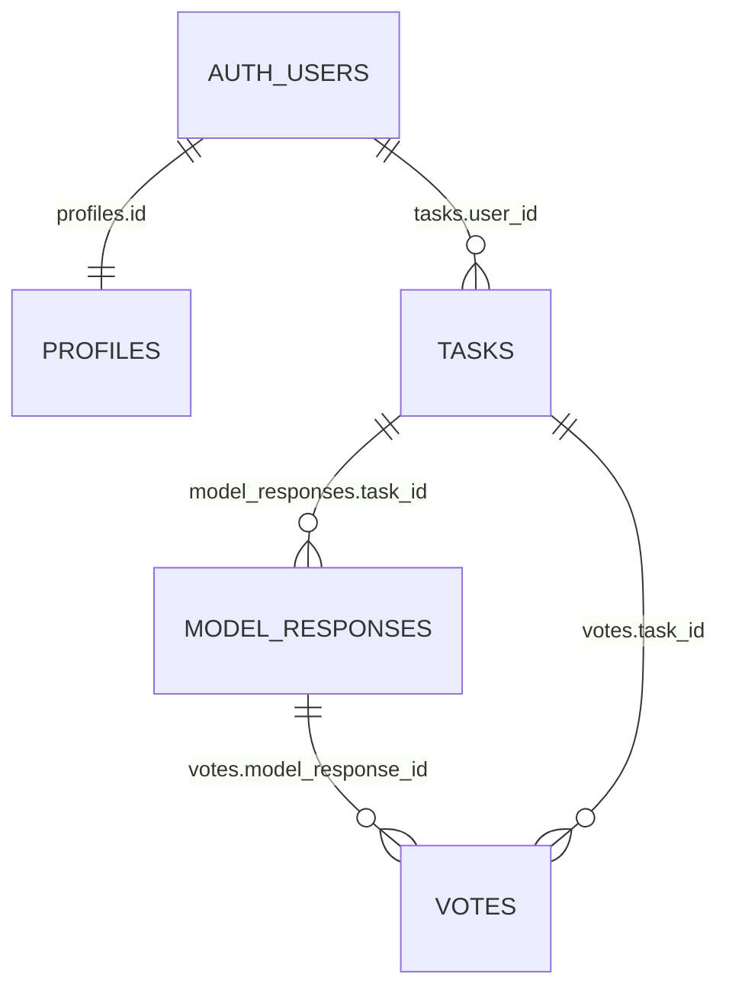

# 29 - Database Ownership Policy

## Назначение файла

Этот документ фиксирует правила владения данными в базе Supabase PostgreSQL для проекта **Новая эпоха**.

Главная цель - не дать Codex, Cursor или другому AI-агенту выдумывать несуществующие поля, ломать связи между таблицами или путать гостевые и авторизованные данные.

Этот файл является архитектурным контрактом для всех изменений, связанных с:

- Supabase migrations;
- PostgreSQL tables;
- foreign keys;
- RLS policies;
- API routes;
- TypeScript database types;
- guest sessions;
- voting logic;
- history logic.

Если этот файл конфликтует со старым кодом, нужно не игнорировать конфликт, а явно обновить миграции, API, типы и документацию в одном изменении.

---

## 1. Главный принцип

Каждая приватная бизнес-строка в базе должна иметь понятный источник владения.

Есть два допустимых способа владения:

```text
user_id
# строка принадлежит авторизованному пользователю

anonymous_session_id
# строка принадлежит гостевой сессии
```

Если таблица не имеет прямого владельца, она должна иметь родительскую сущность, через которую владелец определяется транзитивно.

Пример:

```text
model_responses не хранит user_id напрямую.
# доступ к ответу модели определяется через model_responses.task_id -> tasks.id
```

---

## 2. Ownership Tree

Основное дерево владения для Arena-активности:

```text
auth.users
# системный владелец аккаунта Supabase Auth

  └── profiles
      # публичный профиль приложения, profiles.id = auth.users.id

        └── tasks
            # задача пользователя

              └── model_responses
                  # ответы моделей внутри задачи

                    └── votes
                        # голос за конкретный ответ модели
```

Гостевой сценарий:

```text
anonymous_session_id
# временный владелец данных гостя

  └── tasks
      # гостевые задачи

        └── model_responses
            # ответы моделей по гостевой задаче

              └── votes
                  # гостевые голоса, если guest voting разрешён
```

Важно:

```text
tasks
# корневая бизнес-сущность для Prompt Arena и будущих Arena-режимов
```

Большинство пользовательских данных должны проверять доступ через `tasks`.

---

## 3. Mermaid ERD



Примечание:

```text
anonymous_session_id не показан как отдельная таблица.
# в текущем MVP это text-идентификатор гостевой сессии, а не отдельная таблица anonymous_sessions
```

---

## 4. Термины

| Термин | Значение |
|---|---|
| Owner | Пользователь или гостевая сессия, которые имеют право читать или менять строку |
| Parent | Родительская строка, через которую определяется жизненный цикл дочерней строки |
| Lifecycle anchor | Сущность, при удалении которой дочерние строки должны быть удалены или скрыты |
| Strong ownership | Дочерняя строка не имеет смысла без родителя |
| Weak ownership | Связь с владельцем может измениться, например guest -> user |
| Claiming | Перенос гостевых данных на аккаунт после регистрации или входа |

---

## 5. FK Naming Convention

Внешние ключи должны называться полным именем целевой сущности в единственном числе + `_id`.

Формат:

```text
<target_table_singular>_id
# имя FK должно прямо показывать, на какую таблицу оно ссылается
```

Правильно:

| FK | На что ссылается |
|---|---|
| `task_id` | `tasks.id` |
| `model_response_id` | `model_responses.id` |
| `model_id` | `models.id` |
| `user_id` | `auth.users.id` / `profiles.id`, где UUID совпадает |

Неправильно:

| Нельзя | Почему |
|---|---|
| `response_id` | неясно, что это именно `model_responses.id` |
| `answer_id` | в схеме нет таблицы `answers` |
| `resp_id` | сокращение ломает читаемость и провоцирует ошибки |
| `owner_id` | скрывает тип владельца: user или guest |
| `prompt_id` | в проекте каноническая сущность называется `tasks`, не `prompts` |
| `mode_id` | в MVP используется `mode_slug`, а не отдельная таблица modes |

Исключение:

```text
Если одна таблица имеет две ссылки на одну сущность, имя должно включать роль.
# например parent_task_id или source_task_id, если такая связь реально нужна
```

---

## 6. Канонические имена проекта

### Таблицы

| Назначение | Каноническая таблица |
|---|---|
| Профили пользователей | `profiles` |
| Каталог AI-моделей | `models` |
| Пользовательские задачи | `tasks` |
| Ответы AI-моделей | `model_responses` |
| Голоса пользователей | `votes` |

### Поля

| Назначение | Каноническое поле |
|---|---|
| Текст задачи | `tasks.task_text` |
| Режим задачи | `tasks.mode_slug` |
| Владелец-аккаунт | `tasks.user_id` |
| Владелец-гость | `tasks.anonymous_session_id` |
| Ответ принадлежит задаче | `model_responses.task_id` |
| Голос принадлежит задаче | `votes.task_id` |
| Голос относится к ответу | `votes.model_response_id` |
| Профиль связан с Supabase Auth | `profiles.id` |

API-имена должны использовать camelCase, но сохранять тот же смысл:

| Database | API / TypeScript |
|---|---|
| `task_id` | `taskId` |
| `model_response_id` | `modelResponseId` |
| `anonymous_session_id` | `anonymousSessionId` |
| `task_text` | `taskText` |
| `mode_slug` | `modeSlug` |

Запрещено принимать `responseId` как новое каноническое имя.

---

## 7. Ownership Matrix

| Table | Owner | Parent | Required FK | Delete policy | RLS principle |
|---|---|---|---|---|---|
| `profiles` | account | `auth.users` | `profiles.id` | controlled account delete | only own profile can be edited |
| `models` | system | none | none | restrict/manual | public read for active public models |
| `tasks` | `user_id` XOR `anonymous_session_id` | none | owner field | soft delete preferred | owner can read own task |
| `model_responses` | inherited from `tasks` | `tasks` | `task_id` | `ON DELETE CASCADE` | readable only through owned task |
| `votes` | `user_id` XOR `anonymous_session_id` | `model_responses` and `tasks` | `task_id`, `model_response_id` | `ON DELETE CASCADE` | voter/owner rules + task access |

---

## 8. Table Cards

## 8.1 profiles

Purpose:

```text
profiles хранит application-level профиль пользователя.
# Supabase Auth остаётся системным источником аккаунта
```

Relationship:

```text
profiles.id -> auth.users.id
# UUID профиля совпадает с UUID пользователя Supabase Auth
```

Rules:

- не создавать отдельное поле `profiles.user_id` без отдельного архитектурного решения;
- не создавать публичную таблицу `users` как замену Supabase Auth;
- не хранить секреты в `profiles`;
- редактировать профиль может только сам пользователь;
- публичные поля профиля можно открывать только после отдельного решения.

Allowed fields:

```text
display_name
# имя в интерфейсе

email
# email, если это нужно продукту и не нарушает privacy

created_at
# дата создания

updated_at
# дата обновления
```

Forbidden fields:

```text
OPENROUTER_API_KEY
# секрет нельзя хранить в профиле

SUPABASE_SERVICE_ROLE_KEY
# service role key нельзя хранить в профиле

VERCEL_TOKEN
# deploy token нельзя хранить в профиле
```

---

## 8.2 tasks

Purpose:

```text
tasks хранит пользовательскую задачу для Arena-режимов.
# это корневая бизнес-сущность для Prompt Arena MVP
```

Owner fields:

```text
tasks.user_id
# владелец, если пользователь авторизован

tasks.anonymous_session_id
# владелец, если пользователь гость
```

Canonical task text field:

```text
tasks.task_text
# не prompt_text и не user_prompt
```

XOR owner rule:

```text
user_id заполнен, anonymous_session_id пустой
# задача принадлежит аккаунту

ИЛИ

user_id пустой, anonymous_session_id заполнен
# задача принадлежит гостю
```

Target database constraint:

```sql
ALTER TABLE public.tasks
ADD CONSTRAINT chk_tasks_single_owner
CHECK (
  (user_id IS NOT NULL AND anonymous_session_id IS NULL)
  OR
  (user_id IS NULL AND anonymous_session_id IS NOT NULL)
);
```

MVP note:

```text
Если текущий ранний MVP ещё допускает tasks.user_id = NULL без anonymous_session_id, это временная совместимость.
# целевое состояние должно перейти к XOR-правилу
```

Delete policy:

```text
Soft delete preferred: tasks.deleted_at.
# задача скрывается из обычных SELECT, но история может сохраниться для аудита и аналитики
```

Hard delete:

```text
Hard delete задачи разрешён только в контролируемой процедуре.
# при hard delete должны каскадно удалиться model_responses и votes
```

---

## 8.3 model_responses

Purpose:

```text
model_responses хранит ответы AI-моделей на конкретную задачу.
# ответ модели не существует без tasks.id
```

Parent relationship:

```text
model_responses.task_id -> tasks.id
# сильное владение через задачу
```

Rules:

- `task_id` обязателен;
- не добавлять прямой `user_id` в `model_responses` без отдельного решения;
- доступ к ответам проверяется через родительскую `tasks`;
- нельзя создать ответ без существующей задачи;
- `model_key` хранится server-side для истории и аудита;
- `model_id` может быть `null`, если модель удалена из каталога или была fallback-моделью.

Delete policy:

```text
model_responses.task_id -> tasks.id ON DELETE CASCADE
# при hard delete задачи ответы удаляются автоматически
```

Forbidden:

```text
response_id
# не использовать как FK на model_responses

prompt_id
# не использовать вместо task_id
```

---

## 8.4 votes

Purpose:

```text
votes хранит голос пользователя или гостя за ответ модели.
# голос связан и с задачей, и с конкретным model_response
```

Required relationships:

```text
votes.task_id -> tasks.id
# голос происходит внутри конкретной задачи

votes.model_response_id -> model_responses.id
# голос поставлен за конкретный ответ модели
```

Owner fields:

```text
votes.user_id
# голос авторизованного пользователя

votes.anonymous_session_id
# голос гостевой сессии
```

XOR owner rule:

```text
user_id заполнен, anonymous_session_id пустой
# голос принадлежит аккаунту

ИЛИ

user_id пустой, anonymous_session_id заполнен
# голос принадлежит гостю
```

Target database constraint:

```sql
ALTER TABLE public.votes
ADD CONSTRAINT chk_votes_single_owner
CHECK (
  (user_id IS NOT NULL AND anonymous_session_id IS NULL)
  OR
  (user_id IS NULL AND anonymous_session_id IS NOT NULL)
);
```

Integrity rule:

```text
votes.task_id must match model_responses.task_id.
# нельзя голосовать за ответ из другой задачи
```

Target validation can be implemented in API or database trigger:

```text
SELECT task_id FROM model_responses WHERE id = model_response_id
# этот task_id должен совпадать с votes.task_id
```

Canonical API body:

```json
{
  "taskId": "uuid",
  "modelResponseId": "uuid",
  "voteType": "best"
}
```

Forbidden API body:

```json
{
  "taskId": "uuid",
  "responseId": "uuid"
}
```

Delete policy:

```text
votes.model_response_id -> model_responses.id ON DELETE CASCADE
# если ответ модели удалён, голос удаляется вместе с ним

votes.task_id -> tasks.id ON DELETE CASCADE
# если задача удалена hard delete, голоса удаляются вместе с ней
```

---

## 9. RLS ownership principles

RLS должен соответствовать этому документу.

### tasks

Authenticated user can read own tasks:

```text
tasks.user_id = auth.uid()
# пользователь видит только свои задачи
```

Guest can read own tasks only through current anonymous session:

```text
tasks.anonymous_session_id = current anonymous session id
# гость видит только задачи своей сессии
```

### model_responses

Access is inherited through `tasks`:

```text
model_responses.task_id -> tasks.id -> owner check
# ответ модели можно читать только если доступна родительская задача
```

### votes

Votes must check both access and target integrity:

```text
votes.task_id -> tasks.id -> owner check
# пользователь или гость должен иметь доступ к задаче

votes.model_response_id -> model_responses.id
# голос должен ссылаться на ответ внутри этой же задачи
```

### profiles

Profile editing:

```text
profiles.id = auth.uid()
# пользователь редактирует только свой профиль
```

Important:

```text
SUPABASE_SERVICE_ROLE_KEY обходить RLS может только на сервере.
# frontend никогда не получает service role key
```

---

## 10. Guest to Auth Claiming

Когда гость регистрируется или входит в аккаунт, его история не должна теряться.

Target process:

```text
BEGIN;
# начать транзакцию

Find tasks by anonymous_session_id.
# найти все гостевые задачи текущей сессии

Update tasks.user_id to auth user id.
# передать задачи новому аккаунту

Set tasks.anonymous_session_id to NULL.
# убрать гостевого владельца после переноса

Update votes.user_id to auth user id.
# передать гостевые голоса новому аккаунту, если guest voting включён

Set votes.anonymous_session_id to NULL.
# убрать гостевого владельца после переноса

COMMIT;
# завершить перенос атомарно
```

MVP rule:

```text
На первом этапе claiming делает простой перенос guest -> user.
# сложная дедупликация откладывается на future improvement
```

Deferred improvement:

```text
Дедупликация одинаковых задач и голосов.
# добавлять только после стабильного MVP и тестов
```

Forbidden:

```text
Удалять гостевые tasks сразу после регистрации.
# пользователь потеряет историю

Оставлять одновременно user_id и anonymous_session_id.
# нарушается XOR-владение
```

---

## 11. Soft Delete and Hard Delete

### Soft delete

For `tasks` preferred field:

```text
deleted_at timestamptz null
# если null, задача активна; если заполнено, задача скрыта
```

Default query rule:

```text
WHERE deleted_at IS NULL
# обычные списки истории не показывают удалённые задачи
```

### Hard delete

Hard delete разрешён только для контролируемых процедур:

- GDPR/account deletion;
- admin cleanup;
- test database cleanup;
- explicit user deletion flow.

При hard delete:

```text
tasks deleted -> model_responses deleted -> votes deleted
# дочерние строки не должны становиться orphan records
```

### Current MVP recommendation

| Table | MVP delete policy |
|---|---|
| `tasks` | soft delete preferred |
| `model_responses` | cascade through `tasks` |
| `votes` | cascade through `model_responses` and `tasks` |
| `models` | restrict/manual, do not delete if history needs it |
| `profiles` | controlled account deletion/anonymization |

---

## 12. Required indexes

Indexes are required for owner checks, history pages and RLS performance.

| Table | Required index | Purpose |
|---|---|---|
| `tasks` | `tasks(user_id)` | account history lookup |
| `tasks` | `tasks(anonymous_session_id)` | guest history lookup |
| `tasks` | `tasks(created_at)` | history sorting |
| `model_responses` | `model_responses(task_id)` | load responses for task |
| `votes` | `votes(task_id)` | load votes for task |
| `votes` | `votes(model_response_id)` | count votes for response |
| `votes` | `votes(user_id)` | account vote history |
| `votes` | `votes(anonymous_session_id)` | guest vote history |

Recommended uniqueness for `best` vote:

```text
One best vote per task per user_id.
# авторизованный пользователь выбирает один лучший ответ в задаче

One best vote per task per anonymous_session_id.
# гость выбирает один лучший ответ в задаче
```

Recommended uniqueness for reactions:

```text
One vote_type per model_response_id per owner.
# защита от дублей like/dislike/best
```

---

## 13. API ownership mapping

### POST /api/compare

Creates:

```text
tasks
# задача создаётся первой

model_responses
# ответы создаются только после появления task_id
```

Rules:

- API must create `tasks` before `model_responses`;
- API must save `model_responses.task_id`;
- API must not create model response without task;
- API must not trust model keys from frontend;
- API must validate `modeSlug` and model allowlist.

### GET /api/tasks/:taskId

Reads:

```text
tasks
model_responses
votes
```

Rules:

- first check task ownership;
- then return child model responses;
- then return related votes if product logic allows;
- never return another user's task by raw UUID only.

### POST /api/vote

Canonical request:

```json
{
  "taskId": "uuid",
  "modelResponseId": "uuid",
  "voteType": "best"
}
```

Rules:

- `taskId` is required;
- `modelResponseId` is required;
- `modelResponseId` must exist;
- `model_responses.task_id` must equal `taskId`;
- requester must own or have access to the task;
- `responseId` is not canonical and must not be introduced in new code.

---

## 14. Domain boundaries

| Domain | Tables | Ownership rule |
|---|---|---|
| Identity | `profiles` | `profiles.id = auth.users.id` |
| Catalog | `models` | system-owned public/reference table |
| Task | `tasks` | direct owner through `user_id` or `anonymous_session_id` |
| Content | `model_responses` | inherited owner through `tasks` |
| Engagement | `votes` | owner through voter + parent through task/response |
| System | future logs/rate limits | system-owned with retention policy |

Rules:

```text
Do not create parallel ownership chains.
# не добавлять owner_id рядом с user_id и anonymous_session_id

Do not add direct user_id to every table by habit.
# дочерние таблицы должны наследовать владельца через parent, если это логически правильно

Do not create profiles.user_id while profiles.id already equals auth.users.id.
# две связи на одного пользователя создадут путаницу
```

---

## 15. Forbidden patterns

Do not create or use:

```text
response_id
# вместо этого использовать model_response_id

answer_id
# такой сущности нет в текущей схеме

owner_id
# владелец должен быть явно user_id или anonymous_session_id

prompt_id
# вместо этого использовать task_id

prompt_text
# вместо этого использовать task_text

user_prompt
# вместо этого использовать task_text

mode_id
# в MVP используется mode_slug

profiles.user_id
# не добавлять, пока profiles.id уже равен auth.users.id
```

Temporary compatibility exception:

```text
Старое поле можно поддерживать только как compatibility alias.
# при этом должен быть план удаления и обновление документации
```

---

## 16. New table template

Перед добавлением новой таблицы нужно заполнить этот шаблон в документации:

```text
Table:
# имя таблицы

Domain:
# Identity / Catalog / Task / Content / Engagement / System

Owner field:
# user_id, anonymous_session_id, inherited through parent, or system-owned

Parent field:
# например task_id -> tasks.id

Ownership type:
# strong или weak

Delete policy:
# CASCADE / SET NULL / RESTRICT / soft delete / controlled delete

RLS rule:
# как PostgreSQL/Supabase проверяет доступ

Required indexes:
# какие индексы нужны для FK, owner lookup и history

Forbidden aliases:
# какие старые или сокращённые имена нельзя использовать
```

---

## 17. Codex checklist before database changes

Перед любым изменением базы Codex обязан проверить:

- есть ли у строки прямой owner или parent, через который owner определяется;
- не добавляется ли `response_id` вместо `model_response_id`;
- не добавляется ли `prompt_id` вместо `task_id`;
- не добавляется ли `prompt_text` вместо `task_text`;
- не добавляется ли `owner_id` вместо явных `user_id` / `anonymous_session_id`;
- соблюдается ли XOR-правило для guest/auth ownership;
- определён ли `ON DELETE` для нового FK;
- не появляются ли orphan records после удаления parent;
- нужны ли новые RLS policies;
- нужны ли новые indexes;
- обновлены ли TypeScript-типы;
- обновлены ли API contracts;
- обновлены ли миграции Supabase;
- обновлены ли smoke checks, если затронуты API routes;
- не попали ли секреты или реальные `.env` значения в документацию.

---

## 18. Future improvements

Эти пункты полезны, но не обязательны для первого MVP:

```text
Dedicated anonymous_sessions table.
# можно добавить позже, если понадобится TTL, аудит и управление guest sessions

Database linter in CI.
# проверка FK names, RLS и orphaned tables автоматически

Advanced guest deduplication.
# объединение одинаковых задач после регистрации

Audit fields.
# created_by, updated_by или merged_from_anonymous_session_id добавлять только после стабильной схемы

Organization ownership.
# project_id / organization_id добавлять только после появления командной работы
```

Не добавлять в MVP без отдельного решения:

```text
owned_by
# создаёт вторую систему владения рядом с user_id и anonymous_session_id

created_by как обязательный FK
# может усложнить guest/auth merge и вызвать путаницу

profiles.user_id
# лишнее поле, если profiles.id уже связан с auth.users.id
```

---

## 19. Final rule

Главная цепочка владения проекта:

```text
profiles.id = auth.users.id
# профиль совпадает с пользователем Supabase Auth

tasks.user_id OR tasks.anonymous_session_id
# задача принадлежит аккаунту или гостю

model_responses.task_id -> tasks.id
# ответ принадлежит задаче

votes.model_response_id -> model_responses.id
# голос поставлен за ответ модели

votes.task_id -> tasks.id
# голос происходит внутри конкретной задачи
```

Нельзя создавать параллельную схему владения без отдельного решения в `16-decisions.md`.

Для текущего MVP основной архитектурный принцип такой:

```text
tasks is the ownership root for Arena activity.
# все ответы, голоса и история должны проверяться через задачу
```
