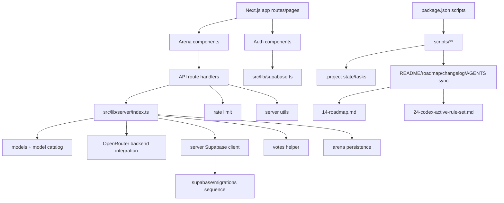

# File Connection Audit

Дата анализа: 2026-06-15  
Корень проекта: `C:\Users\ae995\Desktop\new-era-ai-platform`  
Ветка: `fix/audit-v0.5.4`  
Правило безопасности: значения из `.env.local` и других env-файлов не выводились; в отчете указаны только имена переменных.

## 1. Snapshot

Полный обход выполнялся через рекурсивный `-Force`-эквивалент и включал `.git`, `.next`, `node_modules`, ignored-файлы, generated-файлы, vendor-файлы и env-файлы.

| Метрика | Значение |
| --- | ---: |
| Файлов до создания этого отчета | 23,702 |
| Размер файлов до создания отчета | 1,247,962,441 bytes |
| Не-vendor/non-generated проектных файлов | 172 |
| Code-файлов, разобранных на imports/requires | 61 |
| Markdown-файлов, разобранных на локальные ссылки | 59 |
| Найденных связей | 284 |
| Неразрешенных ссылок/упоминаний | 54 |

Проверка после создания отчета показала `all=23720`, `without_git=23671`, `project_without_git_vendor_next=174`. Значение `all` выше snapshot, потому что в область анализа намеренно включены нестабильные `.git/**` и `.next/**`: во время работы добавились VCS/codex capture objects и Turbopack cache files. Канонический граф связей ниже построен по snapshot до создания этого отчета.

### Категории файлов

| Категория | Файлов | Комментарий |
| --- | ---: | --- |
| `vendor` | 21,958 | `node_modules`, связи внутри не разбирались построчно |
| `generated` | 1,525 | `.next`, `*.tsbuildinfo`, build/cache output |
| `vcs` | 47 | `.git` internals |
| `source` | 42 | `src/**` |
| `docs` | 45 | root/docs markdown |
| `archive` | 14 | `archive/**` |
| `project` | 33 | root config, lockfile, project json/ps1 |
| `supabase` | 17 | migrations and local Supabase state |
| `scripts` | 15 | `scripts/**` |
| `env` | 3 | `.env.example`, `.env.local`, `.env.local.example` |
| `tooling` | 3 | `.githooks`, `.github`, `.vscode` |

### Git state

| Git state | Файлов |
| --- | ---: |
| `tracked` | 161 |
| `ignored` | 23,494 |
| `vcs-internal` | 47 |

## 2. High-Level Connection Graph



Основная runtime-ветка сейчас выглядит связной:

```text
src/app/page.tsx
  -> src/components/auth/auth-status.tsx
    -> src/lib/supabase.ts
    -> src/lib/supabase-proxy.ts

src/app/arena/page.tsx
  -> src/components/arena/prompt-arena.tsx
    -> src/components/arena/arena-form.tsx
    -> src/components/arena/arena-results.tsx
    -> src/components/arena/response-card.tsx
    -> src/types/arena.ts
    -> src/lib/arena/constants.ts
    -> /api/models, /api/compare, /api/vote at runtime

src/app/api/models/route.ts
  -> src/lib/server/index.ts
    -> src/lib/server/model-catalog.ts
    -> src/lib/server/models.ts
    -> src/lib/server/supabase.ts
    -> src/lib/server/utils.ts

src/app/api/compare/route.ts
  -> src/lib/server/index.ts
    -> src/lib/server/openrouter.ts
    -> src/lib/server/rate-limit.ts
    -> src/lib/server/arena-persistence.ts
    -> src/lib/server/utils.ts

src/app/api/vote/route.ts
  -> src/lib/server/index.ts
    -> src/lib/server/votes.ts
    -> src/lib/server/rate-limit.ts
    -> src/lib/server/utils.ts
```

## 3. Entrypoints

Эти файлы не надо считать тупиковыми только потому, что у них нет входящих import-связей: они вызываются Next.js, npm scripts, Vitest, GitHub Actions, git hooks или внешними инструментами.

### Next.js entrypoints

| Файл | Назначение |
| --- | --- |
| `src/app/page.tsx` | home page |
| `src/app/arena/page.tsx` | Prompt Arena page |
| `src/app/login/page.tsx` | login page |
| `src/app/signup/page.tsx` | signup page |
| `src/app/layout.tsx` | root layout |
| `src/app/error.tsx` | route error boundary |
| `src/app/global-error.tsx` | global error boundary |
| `src/app/loading.tsx` | route loading UI |
| `src/app/not-found.tsx` | 404 UI |
| `src/app/api/models/route.ts` | `/api/models` |
| `src/app/api/compare/route.ts` | `/api/compare` |
| `src/app/api/health/route.ts` | `/api/health` |
| `src/app/api/vote/route.ts` | `/api/vote` |
| `src/proxy.ts` | Next proxy/middleware-style auth refresh |

### CLI/script entrypoints

| Файл | Откуда вызывается |
| --- | --- |
| `scripts/check-env.mjs` | `npm run env:check*`, `prebuild` |
| `scripts/check-env.test.mjs` | `npm run test:env-check` |
| `scripts/check-schema-sync.mjs` | `npm run schema:check` |
| `scripts/health-check.mjs` | `npm run health*` |
| `scripts/smoke-check.mjs` | `npm run smoke` |
| `scripts/verify-models.mjs` | `npm run models:verify` |
| `scripts/state/index.mjs` | `npm run state:*` |
| `scripts/sync/index.mjs` | `npm run docs:*` |
| `scripts/git/sync-after-commit.mjs` | `npm run sync:*`, `.githooks/post-commit` |

## 4. Source And Script Edges

| Ветка | Связи |
| --- | --- |
| `src/components/arena/prompt-arena.tsx` | центральный UI-контейнер Prompt Arena; связывает form/results/cards/types/constants |
| `src/components/auth/*` | login/signup/status используют browser/server Supabase helpers |
| `src/lib/server/index.ts` | barrel для server-only helpers; используется API routes |
| `src/lib/server/openrouter.ts` | backend OpenRouter integration, зависит от models/utils/env |
| `src/lib/server/model-catalog.ts` | Supabase catalog resolver + fallback models |
| `src/lib/server/votes.ts` | server-side vote persistence helper |
| `scripts/sync/index.mjs` | подключает plugins `readme`, `roadmap`, `changelog`, `agents`, `package-json` |
| `scripts/state/index.mjs` | использует `scripts/sync/utils.mjs` для project-state операций |
| `scripts/check-env.mjs` | читает `env-check.config.json`, проверяет env contract |

Внешние imports по частоте:

| Package | Вхождений |
| --- | ---: |
| `next` | 18 |
| `react` | 9 |
| `node:url` | 8 |
| `node:fs` | 6 |
| `node:path` | 6 |
| `vitest` | 6 |
| `@next/env` | 4 |
| `@supabase/ssr` | 3 |
| `@supabase/supabase-js` | 3 |
| `node:child_process` | 3 |
| `pg` | 1 |
| `typescript` | 1 |

## 5. Supabase Branch

Миграции образуют линейную последовательность:

```text
0001_prompt_arena_mvp.sql
-> 0002_sync_free_models.sql
-> 0003_profiles.sql
-> 0004_profiles_grants.sql
-> 0005_service_role_models_select.sql
-> 0006_service_role_profiles_grants.sql
-> 20260607212653_harden_profiles_and_indexes.sql
-> 20260608041610_align_mvp_tasks_and_votes.sql
-> 20260609054344_db_integrity_fixes.sql
-> 20260609082216_drop_prompt_text.sql
-> 20260609095422_align_votes_indexes.sql
-> 20260610090000_model_catalog_governance_metadata.sql
-> 20260610110000_add_models_status_column.sql
-> 20260611133000_deactivate_unavailable_free_models.sql
-> 20260615120000_atomic_best_vote_rpc.sql
```

Текущий runtime к Supabase идет через:

```text
src/lib/server/supabase.ts
src/lib/server/model-catalog.ts
src/lib/server/arena-persistence.ts
src/lib/server/votes.ts
src/lib/supabase.ts
src/lib/supabase-proxy.ts
```

Локальные Supabase-файлы `supabase/.branches/_current_branch` и `supabase/.temp/cli-latest` ignored и не являются частью runtime-ветки.

## 6. Env Connections

Env-файлы найдены:

| Файл | Переменные |
| --- | --- |
| `.env.example` | `APP_ENV`, `APP_URL`, `MODEL_TIMEOUT_MS`, `NEXT_PUBLIC_SITE_URL`, `NEXT_PUBLIC_SUPABASE_PUBLISHABLE_KEY`, `NEXT_PUBLIC_SUPABASE_URL`, `OPENROUTER_API_KEY`, `OPENROUTER_MAX_TOKENS`, `SUPABASE_ACCESS_TOKEN`, `SUPABASE_DB_URL`, `SUPABASE_SERVICE_ROLE_KEY`, `UPSTASH_REDIS_REST_TOKEN`, `UPSTASH_REDIS_REST_URL` |
| `.env.local` | `APP_ENV`, `APP_URL`, `MODEL_TIMEOUT_MS`, `NEXT_PUBLIC_SITE_URL`, `NEXT_PUBLIC_SUPABASE_PUBLISHABLE_KEY`, `NEXT_PUBLIC_SUPABASE_URL`, `OPENROUTER_API_KEY`, `OPENROUTER_MAX_TOKENS`, `SUPABASE_SERVICE_ROLE_KEY` |
| `.env.local.example` | `APP_ENV`, `APP_URL`, `MODEL_TIMEOUT_MS`, `NEXT_PUBLIC_SITE_URL`, `NEXT_PUBLIC_SUPABASE_PUBLISHABLE_KEY`, `NEXT_PUBLIC_SUPABASE_URL`, `OPENROUTER_API_KEY`, `OPENROUTER_MAX_TOKENS`, `SUPABASE_ACCESS_TOKEN`, `SUPABASE_DB_URL`, `SUPABASE_SERVICE_ROLE_KEY`, `UPSTASH_REDIS_REST_TOKEN`, `UPSTASH_REDIS_REST_URL` |

Переменные, реально встречающиеся в `process.env.*`:

```text
ALLOW_DEGRADED
CI
DATABASE_URL
ENV_CHECK_DIR
GIT_AUTO_SYNC_AFTER_COMMIT
MODEL_TIMEOUT_MS
NEXT_PUBLIC_SITE_URL
NEXT_PUBLIC_SUPABASE_ANON_KEY
NEXT_PUBLIC_SUPABASE_PUBLISHABLE_KEY
NEXT_PUBLIC_SUPABASE_URL
NODE_ENV
NO_GIT_AUTO_SYNC
OPENROUTER_API_KEY
OPENROUTER_MAX_TOKENS
SMOKE_BASE_URL
SUPABASE_DB_URL
SUPABASE_SERVICE_ROLE_KEY
UPSTASH_REDIS_REST_TOKEN
UPSTASH_REDIS_REST_URL
VERCEL
VERCEL_ENV
VERCEL_GIT_COMMIT_SHA
```

Наблюдение: `NEXT_PUBLIC_SUPABASE_ANON_KEY` используется в коде/скриптах как совместимый fallback, но в `.env.local` сейчас найден только `NEXT_PUBLIC_SUPABASE_PUBLISHABLE_KEY`.

## 7. Dead-End Analysis

Определения:

- `Нет входящих связей`: файл не найден как target import/doc/script/migration edge и не помечен как entrypoint.
- `Лист`: у файла нет исходящих связей в построенном графе.
- Vendor/generated/VCS файлы отделены, чтобы не смешивать их с проектными решениями.

### Файлы без входящих связей, требующие внимания

| Файл | Почему обратить внимание |
| --- | --- |
| `01-idea.md` | концептуальный документ, не найден в локальных ссылках |
| `03-tools-and-sites.md` | справочник инструментов, не найден в локальных ссылках |
| `05-user-roles.md` | продуктовая спецификация, не найдена в локальных ссылках |
| `13-deployment.md` | deployment doc, не найден в локальных ссылках |
| `19-development-checklist.md` | checklist, не найден в локальных ссылках |
| `20-auth-guest-profile-plan.md` | будущая v0.6 auth/profile ветка, пока не связана с runtime |
| `21-access-gate-policy.md` | будущая access policy, пока не связана с runtime |
| `23-codex-quality-rules.md` | quality doc, не найден в локальных ссылках |
| `27-environments.md` | env/deploy doc, не найден в локальных ссылках |
| `29-apply-documentation-audit-fixes.ps1` | standalone PowerShell utility, не вызывается package scripts |
| `33-feature-flags.md` | future feature flags doc, не связан с runtime |
| `34-manual-qa-checklist.md` | ручной QA checklist, не связан с scripts |
| `35-database-schema-sync.md` | schema sync doc, не связан с scripts |
| `40-project-health-check.md` | health-check doc, не связан с scripts |
| `postcss.config.mjs` | framework config; нормально может не иметь входящих import-связей |
| `vitest.config.ts` | tool config; нормально может не иметь входящих import-связей |
| `next-env.d.ts` | generated Next TypeScript bridge; нормально может не иметь входящих import-связей |

### Технически без входящих связей, но это нормально

| Файл/ветка | Причина |
| --- | --- |
| `src/app/**/page.tsx`, `layout.tsx`, `route.ts`, `error.tsx`, `loading.tsx`, `not-found.tsx` | вызываются Next.js framework conventions |
| `src/proxy.ts` | вызывается Next.js proxy convention |
| `src/lib/server/*.test.ts` | вызываются Vitest file discovery, а не import graph |
| `.github/workflows/ci.yml` | вызывается GitHub Actions |
| `.githooks/post-commit` | вызывается Git hook при установленном hooksPath |
| `.gitignore`, `.nvmrc`, `.vscode/extensions.json` | tooling/editor/runtime convention files |
| `supabase/migrations/0001_prompt_arena_mvp.sql` | первый элемент migration chain |
| `.project/tasks/*.json` | project-state файлы, используются state/docs tooling conceptually, не как imports |
| `archive/**` | исторические документы, допустимо быть слабо связанными |

### Листья графа

Лист не всегда проблема: constants/types/configs/docs часто являются нормальными листьями.

| Файл/ветка | Трактовка |
| --- | --- |
| `src/lib/arena/constants.ts` | нормальный leaf: источник constants для Arena |
| `src/types/arena.ts` | нормальный leaf: типы импортируются, сами никого не импортируют |
| `src/app/globals.css` | нормальный leaf: CSS imported by layout |
| `src/components/auth/auth-messages.ts` | нормальный leaf: текстовые сообщения |
| `src/app/error.tsx`, `global-error.tsx`, `loading.tsx`, `not-found.tsx` | framework UI leaves |
| `scripts/sync/utils.mjs` | utility leaf по outgoing-связям, но имеет 6 входящих связей |
| `scripts/health-check.mjs` | CLI leaf, вызывается package script |
| `scripts/check-env.test.mjs` | test leaf, вызывается test script |
| `env-check.config.json` | config leaf, читается `scripts/check-env.mjs` |
| `package-lock.json` | lockfile leaf |
| `tsconfig.json`, `next.config.ts`, `eslint.config.mjs`, `postcss.config.mjs`, `vitest.config.ts` | tool/framework config leaves |
| `supabase/migrations/20260615120000_atomic_best_vote_rpc.sql` | последний элемент migration chain |
| `08-database.md`, `09-api-structure.md`, `10-ui-pages.md`, `11-ai-models.md`, `14-roadmap.md`, `15-changelog.md`, `18-team-mode-spec.md`, `24-codex-active-rule-set.md`, `25-definition-of-done.md`, `28-api-contracts.md`, `29-database-ownership.md`, `30-data-retention-policy.md`, `31-image-arena-spec.md` | docs leaves; не runtime dead code |

## 8. Unresolved/Broken References

Неразрешенные элементы в основном не являются broken imports. Они делятся на три группы:

| Группа | Примеры | Трактовка |
| --- | --- | --- |
| URL routes in docs | `/`, `/arena`, `/api/models`, `/api/compare`, `/api/health`, `/api/vote` | это веб-маршруты, не файловые пути |
| Future/planned docs refs | `/api/v1/models`, `/arena-voting`, `src/components/arena/prompt-arena-voting.tsx` | вероятно ссылки на будущие или удаленные планы; проверить при документальном аудите |
| Markdown parser false positives | fenced blocks like `env ...`, `text ...`, model ids such as `qwen/...` | это не файловые ссылки |

Реально подозрительные локальные ссылки:

| From | Ref |
| --- | --- |
| `archive/19a-nextjs-setup.md` | `28-documentation-audit-fresh.md` |
| `archive/30-project-audit-report-v0.4.1.md` | `28-action-plan.md` |
| `archive/30-project-audit-report-v0.4.1.md` | bare refs `index.ts`, `models.ts`, `openrouter.ts`, `utils.ts` without path |
| `archive/33-audit-sync-and-voting-mvp.md` | `src/components/arena/prompt-arena-voting.tsx` |
| `35-database-schema-sync.md` | `20260610110000_add_models_status_column.sql` without `supabase/migrations/` prefix |

## 9. Vendor/Generated Branches

### `node_modules`

`node_modules` содержит 21,958 файлов. Это vendor-ветка, не проектный тупик.

Крупнейшие пакеты:

| Package | Файлов |
| --- | ---: |
| `next` | 8,131 |
| `es-abstract` | 2,480 |
| `caniuse-lite` | 839 |
| `zod` | 718 |
| `@typescript-eslint/eslint-plugin` | 468 |
| `eslint` | 426 |
| `@swc/helpers` | 422 |
| `eslint-plugin-react` | 406 |
| `@typescript-eslint/scope-manager` | 359 |
| `@babel/helpers` | 251 |
| `@supabase/auth-js` | 197 |
| `typescript` | 140 |
| `vitest` | 124 |
| `@supabase/ssr` | 101 |

### `.next`

`.next` содержит 1,525 файлов. Это generated/runtime build branch.

| Branch | Файлов |
| --- | ---: |
| `.next/dev` | 1,206 |
| `.next/server` | 259 |
| `.next/static` | 21 |
| `.next/build` | 13 |
| `.next/cache` | 3 |
| `.next/diagnostics` | 3 |
| `.next/types` | 3 |
| `.next/* root manifests` | 17 |

### `.git`

`.git` содержит 47 файлов и полностью относится к VCS internals.

## 10. Inventory Appendix

Полный файловый inventory был собран для всего дерева. Для читаемости в этом отчете:

- project/source/script/supabase/docs/archive/root files раскрыты по веткам выше;
- `node_modules` раскрыт как package-level inventory;
- `.next` раскрыт как generated branch inventory;
- `.git` раскрыт как VCS branch inventory;
- env-файлы раскрыты только по именам переменных.

Ключевые root-файлы:

```text
.env.example
.env.local
.env.local.example
.gitignore
.nvmrc
00-readme.md
01-idea.md
02-project-plan.md
03-tools-and-sites.md
04-mvp-scope.md
05-user-roles.md
06-project-modes.md
07-architecture.md
08-database.md
09-api-structure.md
10-ui-pages.md
11-ai-models.md
12-security-and-env.md
13-deployment.md
14-roadmap.md
15-changelog.md
16-decisions.md
17-code-arena-spec.md
18-team-mode-spec.md
19-development-checklist.md
20-auth-guest-profile-plan.md
21-access-gate-policy.md
23-codex-quality-rules.md
24-codex-active-rule-set.md
25-definition-of-done.md
27-environments.md
28-api-contracts.md
29-apply-documentation-audit-fixes.ps1
29-database-ownership.md
29-database-ownership-policy.md
30-data-retention-policy.md
31-image-arena-spec.md
32-model-catalog-governance.md
33-feature-flags.md
34-manual-qa-checklist.md
35-database-schema-sync.md
36-document-sync-policy.md
40-project-health-check.md
AGENTS.md
README.md
env-check.config.json
eslint.config.mjs
next-env.d.ts
next.config.ts
package-lock.json
package.json
postcss.config.mjs
tsconfig.json
tsconfig.tsbuildinfo
vitest.config.ts
```

Source inventory:

```text
src/app/api/compare/route.ts
src/app/api/health/route.ts
src/app/api/models/route.ts
src/app/api/vote/route.ts
src/app/arena/page.tsx
src/app/error.tsx
src/app/global-error.tsx
src/app/globals.css
src/app/layout.tsx
src/app/loading.tsx
src/app/login/page.tsx
src/app/not-found.tsx
src/app/page.tsx
src/app/signup/page.tsx
src/components/arena/arena-form.tsx
src/components/arena/arena-results.tsx
src/components/arena/prompt-arena.tsx
src/components/arena/response-card.tsx
src/components/auth/auth-messages.ts
src/components/auth/auth-status.tsx
src/components/auth/login-form.tsx
src/components/auth/signup-form.tsx
src/lib/arena/constants.ts
src/lib/server/arena-persistence.ts
src/lib/server/auth.ts
src/lib/server/index.ts
src/lib/server/model-catalog.test.ts
src/lib/server/model-catalog.ts
src/lib/server/models.test.ts
src/lib/server/models.ts
src/lib/server/openrouter.ts
src/lib/server/rate-limit.test.ts
src/lib/server/rate-limit.ts
src/lib/server/supabase.ts
src/lib/server/utils.test.ts
src/lib/server/utils.ts
src/lib/server/votes.test.ts
src/lib/server/votes.ts
src/lib/supabase-proxy.ts
src/lib/supabase.ts
src/proxy.ts
src/types/arena.ts
```

Scripts inventory:

```text
scripts/check-env.mjs
scripts/check-env.test.mjs
scripts/check-schema-sync.mjs
scripts/git/sync-after-commit.mjs
scripts/health-check.mjs
scripts/smoke-check.mjs
scripts/state/index.mjs
scripts/sync/index.mjs
scripts/sync/plugins/agents.mjs
scripts/sync/plugins/changelog.mjs
scripts/sync/plugins/package-json.mjs
scripts/sync/plugins/readme.mjs
scripts/sync/plugins/roadmap.mjs
scripts/sync/utils.mjs
scripts/verify-models.mjs
```

## 11. Interpretation

Главный runtime-код не выглядит разорванным: Next pages/API routes, Arena UI, auth UI, server helpers, Supabase helpers и migrations образуют понятные ветки.

Основные “тупики”, которые стоит проверить вручную, находятся не в runtime-коде, а в документации и проектной инфраструктуре:

- часть root markdown документов не связана локальными ссылками, хотя может быть intentionally standalone;
- `archive/**` содержит исторические ссылки на удаленные/переименованные документы и компоненты;
- `.project/backups/**`, `supabase/.temp/**`, `.next/**`, `tsconfig.tsbuildinfo` и `node_modules/**` являются generated/ignored ветками;
- `29-apply-documentation-audit-fixes.ps1` не подключен к npm scripts и выглядит как standalone utility;
- `34-manual-qa-checklist.md`, `35-database-schema-sync.md`, `40-project-health-check.md` можно связать с README/roadmap/docs index, если нужна более строгая документационная навигация.

## 12. Verification Notes

- `@/*` alias учитывался как `src/*` на основе `tsconfig.json`.
- Проверка alias: `alias-ok:@/*->./src/*`.
- Next.js convention entrypoints помечены отдельно и не трактуются как runtime-тупики.
- Npm scripts из `package.json` учитывались как входящие связи к `scripts/**`.
- Supabase migrations связаны линейной migration-sequence веткой.
- Env-файлы проверялись только по именам ключей; значения не включены в отчет.
- Проверка env assignment leakage: `env-assignments-ok`; в отчете нет строк вида `KEY=value` из `.env.local`.
